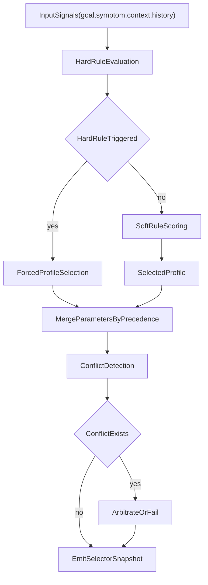
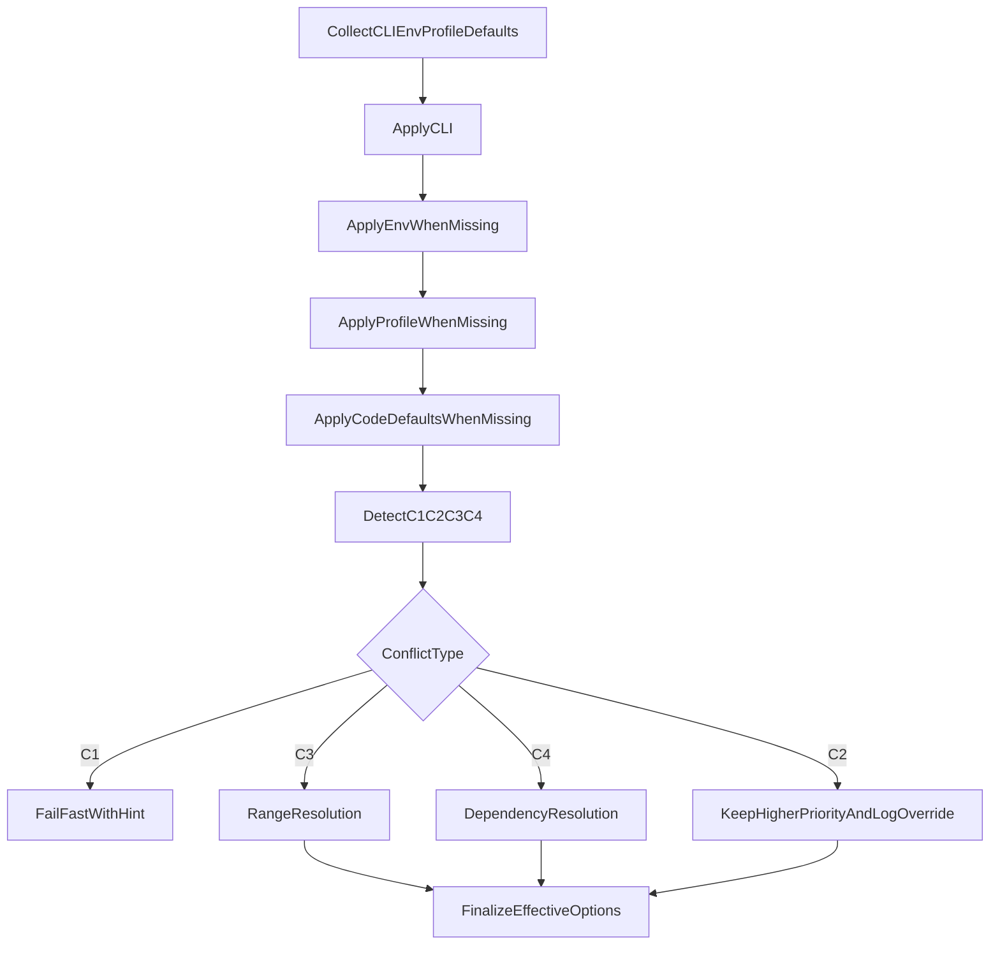
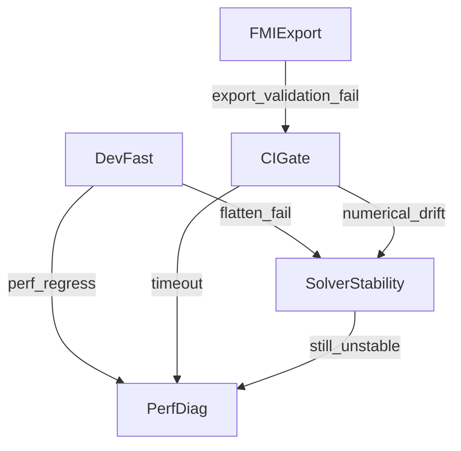

# JIT Parameter Convergence and Intelligent Selector Specification

## 1. Scope and goals

This document defines a documentation-first specification for:

- parameter convergence across CLI flags and environment variables,
- profile-based scenario strategies,
- intelligent profile selection,
- option precedence and conflict arbitration,
- machine-readable outputs used by future CLI/TUI integration.

This specification does not change current Rust execution logic. It standardizes how future implementations should reason about existing options.

## 2. Source baseline

Primary audited sources:

- `jit-compiler/src/main.rs`
- `crates/regress-harness/src/main.rs`
- `jit-compiler/src/compiler/pipeline/frontend.rs`
- `jit-compiler/src/compiler/compile_model.rs`
- `jit-compiler/src/flatten/flatten_cache.rs`
- `jit-compiler/src/fmi.rs`

Machine-readable companion assets:

- `parameter-metadata.json`
- `profile-templates.json`

## 3. Parameter layering model

### 3.1 Core layer

Core options are expected to cover most daily workflows and should stay visible by default:

- validation and tiering: `--validate`, `--validate-tier`, `--validation-mode`
- simulation baseline: `--solver`, `--t-end`, `--dt`, `--output-interval`
- deterministic cache controls: `RUSTMODLICA_SALSA`, `RUSTMODLICA_QUERY_CACHE`, `RUSTMODLICA_QUERY_CACHE_NAMESPACE`

### 3.2 Advanced layer

Advanced options are conditionally exposed when users enter tuning or stability workflows:

- flatten and dimensional policy: `--array-size-policy`, `--array-sizes-json`
- structural and numerical tuning: `--index-reduction-method`, `--tearing-method`, `--overdet-check`, `--overdet-tol`
- cache topology controls: `RUSTMODLICA_FLATTEN_CACHE_DIR`, `RUSTMODLICA_LIBS_EPOCH_CACHE`
- FMI export controls: `--emit-fmu`, `--emit-fmu-me`, `--fmi-model-id`, `--fmi-guid`

### 3.3 Diagnostic layer

Diagnostic options are noisy and should be explicitly temporary:

- `RUSTMODLICA_PERF_TRACE`
- `RUSTMODLICA_STAGE_TRACE`
- `RUSTMODLICA_CACHE_STATS_JSON`
- `RUSTMODLICA_DEP_GRAPH_JSON`
- event-level diagnostics and deadband tuners used in event-scan workflows

## 4. Scenario profiles

Defined profiles:

- `DevFast`
- `CIGate`
- `PerfDiag`
- `SolverStability`
- `FMIExport`

Normative source: `profile-templates.json`.

### 4.1 Scenario x parameter matrix (full catalog)

Legend:

- `M`: must/use by default in this profile
- `O`: optional/allowed on demand
- `-`: generally not needed
- `X`: discouraged or forbidden for this profile

Profiles:
- `D`: DevFast
- `C`: CIGate
- `P`: PerfDiag
- `S`: SolverStability
- `F`: FMIExport

#### 4.1.1 Core layer

| Parameter | Layer | D | C | P | S | F | Note |
|---|---|---|---|---|---|---|---|
| `RUSTMODLICA_LANG` | Core | O | M | O | O | O | locale consistency in pipelines |
| `RUSTMODLICA_SALSA` | Core | M | M | M | O | O | query pipeline pin |
| `RUSTMODLICA_QUERY_CACHE` | Core | M | M | M | M | O | disable only for special debugging |
| `RUSTMODLICA_QUERY_CACHE_NAMESPACE` | Core | O | M | M | O | O | CI/perf isolation |

#### 4.1.2 Advanced layer

| Parameter | Layer | D | C | P | S | F | Note |
|---|---|---|---|---|---|---|---|
| `RUSTMODLICA_FLATTEN_CACHE_DIR` | Advanced | O | M | M | O | O | deterministic cache root |
| `RUSTMODLICA_INSTALL_ROOT` | Advanced | - | O | O | - | O | only when install layout is custom |
| `RUSTMODLICA_FLATTEN_CACHE_TTL_MS` | Advanced | O | O | O | O | - | cache aging tuning |
| `RUSTMODLICA_FLATTEN_FULL_CACHE` | Advanced | O | O | O | O | - | force full flatten cache |
| `RUSTMODLICA_LIBS_EPOCH_CACHE` | Advanced | O | M | M | O | O | keep enabled for reproducibility |
| `RUSTMODLICA_CACHE_SQLITE` | Advanced | O | M | M | O | O | storage backend |
| `RUSTMODLICA_CACHE_SHM` | Advanced | O | O | O | O | - | memory tier cache |
| `RUSTMODLICA_CACHE_SHM_NAME` | Advanced | O | O | O | - | - | shared memory identifier |
| `RUSTMODLICA_CACHE_SHM_SEG_MB` | Advanced | O | O | O | - | - | segment sizing |
| `RUSTMODLICA_CACHE_SHM_INDEX_CAP` | Advanced | O | O | O | - | - | index capacity tuning |
| `RUSTMODLICA_AOT_CACHE_DIR` | Advanced | O | O | O | O | O | AOT marker cache |
| `RUSTMODLICA_JIT_POLICY_JSON` | Advanced | O | O | O | O | O | JIT policy overlay |
| `RUSTMODLICA_JIT_VAR_POLICY_JSON` | Advanced | O | O | O | O | O | legacy fallback policy overlay |
| `RUSTMODLICA_JIT_POLICY_STRICT` | Advanced | O | O | O | O | - | strict policy validation |
| `RUSTMODLICA_JIT_VAR_STRICT` | Advanced | O | O | O | O | - | strict var policy |
| `RUSTMODLICA_JIT_CODEGEN_CACHE` | Advanced | O | M | O | O | O | CI warm path optimization |
| `RUSTMODLICA_JIT_CODEGEN_CACHE_DIR` | Advanced | O | M | M | O | O | deterministic cache location |
| `RUSTMODLICA_JIT_CODEGEN_CACHE_MAX_EQUATIONS` | Advanced | O | O | O | O | - | cap for disk put |
| `RUSTMODLICA_JIT_STUB_PARALLEL` | Advanced | O | O | O | O | - | compile throughput tuning |
| `RUSTMODLICA_JIT_PARTITION_SCAN_PARALLEL` | Advanced | O | O | O | O | - | partition scanning |
| `RUSTMODLICA_CRANELIFT_OPT_LEVEL` | Advanced | O | O | O | O | O | JIT optimize level |
| `RUSTMODLICA_CRANELIFT_AOT_OPT_LEVEL` | Advanced | O | O | O | O | O | AOT optimize level |
| `RUSTMODLICA_CRANELIFT_ENABLE_SIMD` | Advanced | O | O | O | O | O | platform-sensitive |
| `RUSTMODLICA_OVERDET_CHECK` | Advanced | O | O | O | M | O | structural consistency |
| `RUSTMODLICA_OVERDET_RESIDUAL_TOL` | Advanced | O | O | O | M | O | stability tuning |
| `RUSTMODLICA_NEWTON_SPARSE_POLICY` | Advanced | O | O | O | M | - | nonlinear solve path |
| `RUSTMODLICA_NEWTON_DUAL_PATH_CHECK` | Advanced | O | O | O | M | - | cross-path consistency |
| `RUSTMODLICA_NEWTON_PATH` | Advanced | O | O | O | M | - | force solver path |
| `RUSTMODLICA_NEWTON_SYMBOLIC_JACOBIAN` | Advanced | O | O | O | M | - | symbolic jacobian toggle |
| `RUSTMODLICA_SPARSE_MIN_SIZE` | Advanced | O | O | O | M | - | sparse threshold |
| `RUSTMODLICA_SPARSE_DENSITY_THRESHOLD` | Advanced | O | O | O | M | - | sparse density threshold |
| `RUSTMODLICA_STRICT_NEWTON` | Advanced | O | O | O | M | - | strict convergence |
| `RUSTMODLICA_SYNC_WARN` | Advanced | O | O | O | O | - | sync diagnostics aid |
| `RUSTMODLICA_TEAR_W_OCC` | Advanced | O | O | O | M | - | tearing weight |
| `RUSTMODLICA_TEAR_W_NONLINEAR` | Advanced | O | O | O | M | - | tearing weight |
| `RUSTMODLICA_TEAR_W_SOLVABLE` | Advanced | O | O | O | M | - | tearing weight |
| `RUSTMODLICA_TEAR_W_RESIDUAL` | Advanced | O | O | O | M | - | tearing weight |
| `RUSTMODLICA_TEAR_DM_W_OCC` | Advanced | O | O | O | M | - | tearing weight |
| `RUSTMODLICA_TEAR_DM_W_NONLINEAR` | Advanced | O | O | O | M | - | tearing weight |
| `RUSTMODLICA_TEAR_DM_W_FRONTLOAD` | Advanced | O | O | O | M | - | tearing weight |
| `RUSTMODLICA_TEAR_DM_W_SOLVABLE` | Advanced | O | O | O | M | - | tearing weight |
| `RUSTMODLICA_CONNECT_WARN` | Advanced | O | O | O | O | - | connection warnings |
| `RUSTMODLICA_FLATTEN_DECL_PARALLEL` | Advanced | O | O | O | O | - | flatten throughput |
| `RUSTMODLICA_FLATTEN_DECL_PARALLEL_MIN_ITEMS` | Advanced | O | O | O | O | - | threshold |
| `RUSTMODLICA_FLATTEN_RESOLVE_PARALLEL` | Advanced | O | O | O | O | - | resolve throughput |
| `RUSTMODLICA_FLATTEN_RESOLVE_PARALLEL_MIN_ITEMS` | Advanced | O | O | O | O | - | threshold |
| `RUSTMODLICA_FLATTEN_EQ_PARALLEL` | Advanced | O | O | O | O | - | equation parallel |
| `RUSTMODLICA_FLATTEN_EQ_PARALLEL_MIN_ITEMS` | Advanced | O | O | O | O | - | threshold |
| `RUSTMODLICA_FLATTEN_EQ_MICRO_BATCH` | Advanced | O | O | O | O | - | micro-batch size |
| `RUSTMODLICA_FLATTEN_EQ_MICRO_BATCH_BUDGET` | Advanced | O | O | O | O | - | micro-batch budget |
| `RUSTMODLICA_EQ_EXPAND_PARALLEL_MODE` | Advanced | O | O | O | O | - | parallel mode |
| `RUSTMODLICA_EQ_PARALLEL_TIER_SMALL_MAX` | Advanced | O | O | O | O | - | tier threshold |
| `RUSTMODLICA_EQ_PARALLEL_TIER_MEDIUM_MAX` | Advanced | O | O | O | O | - | tier threshold |
| `RUSTMODLICA_EQ_PARALLEL_GUARD` | Advanced | O | O | O | O | - | adaptive guard |
| `RUSTMODLICA_EQ_PARALLEL_GUARD_MODEL_SIZE_MIN` | Advanced | O | O | O | O | - | guard activation lower bound |
| `RUSTMODLICA_EQ_PARALLEL_GUARD_STREAK` | Advanced | O | O | O | O | - | global guard streak fallback |
| `RUSTMODLICA_EQ_PARALLEL_GUARD_DEGRADE_PCT` | Advanced | O | O | O | O | - | global degrade percent fallback |
| `RUSTMODLICA_EQ_PARALLEL_GUARD_SHARE_MIN_PCT` | Advanced | O | O | O | O | - | global share threshold fallback |
| `RUSTMODLICA_EQ_PARALLEL_GUARD_STREAK_SMALL` | Advanced | O | O | O | O | - | tier guard streak |
| `RUSTMODLICA_EQ_PARALLEL_GUARD_STREAK_MEDIUM` | Advanced | O | O | O | O | - | tier guard streak |
| `RUSTMODLICA_EQ_PARALLEL_GUARD_STREAK_LARGE` | Advanced | O | O | O | O | - | tier guard streak |
| `RUSTMODLICA_EQ_PARALLEL_GUARD_DEGRADE_PCT_SMALL` | Advanced | O | O | O | O | - | tier guard degrade percent |
| `RUSTMODLICA_EQ_PARALLEL_GUARD_DEGRADE_PCT_MEDIUM` | Advanced | O | O | O | O | - | tier guard degrade percent |
| `RUSTMODLICA_EQ_PARALLEL_GUARD_DEGRADE_PCT_LARGE` | Advanced | O | O | O | O | - | tier guard degrade percent |
| `RUSTMODLICA_EQ_PARALLEL_GUARD_SHARE_MIN_PCT_SMALL` | Advanced | O | O | O | O | - | tier guard share threshold |
| `RUSTMODLICA_EQ_PARALLEL_GUARD_SHARE_MIN_PCT_MEDIUM` | Advanced | O | O | O | O | - | tier guard share threshold |
| `RUSTMODLICA_EQ_PARALLEL_GUARD_SHARE_MIN_PCT_LARGE` | Advanced | O | O | O | O | - | tier guard share threshold |
| `RUSTMODLICA_EQ_PARALLEL_GUARD_COOLDOWN_SMALL` | Advanced | O | O | O | O | - | tier guard cooldown |
| `RUSTMODLICA_EQ_PARALLEL_GUARD_COOLDOWN_MEDIUM` | Advanced | O | O | O | O | - | tier guard cooldown |
| `RUSTMODLICA_EQ_PARALLEL_GUARD_COOLDOWN_LARGE` | Advanced | O | O | O | O | - | tier guard cooldown |
| `RUSTMODLICA_EQ_PARALLEL_GUARD_SEED_EQ_US_SMALL` | Advanced | O | O | O | O | - | tier seed eq timing |
| `RUSTMODLICA_EQ_PARALLEL_GUARD_SEED_EQ_US_MEDIUM` | Advanced | O | O | O | O | - | tier seed eq timing |
| `RUSTMODLICA_EQ_PARALLEL_GUARD_SEED_EQ_US_LARGE` | Advanced | O | O | O | O | - | tier seed eq timing |
| `RUSTMODLICA_EQ_PARALLEL_GUARD_SEED_SHARE_PCT_SMALL` | Advanced | O | O | O | O | - | tier seed share percent |
| `RUSTMODLICA_EQ_PARALLEL_GUARD_SEED_SHARE_PCT_MEDIUM` | Advanced | O | O | O | O | - | tier seed share percent |
| `RUSTMODLICA_EQ_PARALLEL_GUARD_SEED_SHARE_PCT_LARGE` | Advanced | O | O | O | O | - | tier seed share percent |
| `RUSTMODLICA_EQ_PARALLEL_GUARD_SEED_STREAK_SMALL` | Advanced | O | O | O | O | - | tier seed streak |
| `RUSTMODLICA_EQ_PARALLEL_GUARD_SEED_STREAK_MEDIUM` | Advanced | O | O | O | O | - | tier seed streak |
| `RUSTMODLICA_EQ_PARALLEL_GUARD_SEED_STREAK_LARGE` | Advanced | O | O | O | O | - | tier seed streak |
| `RUSTMODLICA_INLINE_PARALLEL_POC` | Advanced | O | O | O | O | - | inline PoC toggle |
| `RUSTMODLICA_INLINE_PARALLEL_MIN_ITEMS` | Advanced | O | O | O | O | - | threshold |
| `RUSTMODLICA_INLINE_MAX_DEPTH` | Advanced | O | O | O | O | - | traversal depth |
| `RUSTMODLICA_SALSA_PROCESS_DB` | Advanced | O | O | O | O | - | process DB reuse |
| `RUSTMODLICA_SALSA_PROCESS_DB_SLOTS` | Advanced | O | O | O | O | - | slot cap |
| `RUSTMODLICA_SCRIPT_ENGINE` | Advanced | O | O | - | - | O | mos/legacy choice |
| `RUSTMODLICA_EVENT_DEADBAND` | Advanced | O | O | O | M | - | event stability |
| `RUSTMODLICA_EVENT_DEADBAND_SCALE` | Advanced | O | O | O | M | - | event stability |
| `RUSTMODLICA_EVENT_COUNT_DEADBAND` | Advanced | O | O | O | M | - | event stability |
| `RUSTMODLICA_EVENT_COUNT_DEADBAND_SCALE` | Advanced | O | O | O | M | - | event stability |
| `RUSTMODLICA_EVENT_MAX_SAME_HITS` | Advanced | O | O | O | M | - | event stability |
| `RUSTMODLICA_IDA_ALLOW_HIGH_INDEX` | Advanced | O | O | O | M | - | high-index override |
| `RUSTMODLICA_TAIL_CROSSING_DEADBAND` | Advanced | O | O | O | M | - | tail filter |
| `RUSTMODLICA_TAIL_HEIGHT_DEADBAND` | Advanced | O | O | O | M | - | tail filter |
| `RUSTMODLICA_TAIL_VELOCITY_DEADBAND` | Advanced | O | O | O | M | - | tail filter |
| `RUSTMODLICA_SUNDIALS_DENSE_MAX_N` | Advanced | O | O | O | M | - | linsol policy |
| `RUSTMODLICA_SUNDIALS_KLU_MIN_N` | Advanced | O | O | O | M | - | linsol policy |
| `RUSTMODLICA_SUNDIALS_SPGMR_MAX_N` | Advanced | O | O | O | M | - | linsol policy |
| `RUSTMODLICA_SUNDIALS_LINSOL` | Advanced | O | O | O | M | - | auto/dense/spgmr/klu |
| `RUSTMODLICA_SUNDIALS_SPGMR_MAXL` | Advanced | O | O | O | M | - | Krylov cap |
| `RUSTMODLICA_SUNDIALS_MAX_ORDER` | Advanced | O | O | O | M | - | solver control |
| `RUSTMODLICA_SUNDIALS_MAX_NL_ITERS` | Advanced | O | O | O | M | - | solver control |
| `RUSTMODLICA_SUNDIALS_MAX_STEP` | Advanced | O | O | O | M | - | solver control |
| `RUSTMODLICA_FMI_MODEL_ID` | Advanced | X | O | O | X | M | export identity |
| `RUSTMODLICA_FMI_MODEL_ID_PREFIX` | Advanced | X | O | O | X | M | export identity |
| `RUSTMODLICA_FMI_GUID` | Advanced | X | O | O | X | M | export identity |
| `RUSTMODLICA_FMI_GENERATION_TOOL` | Advanced | X | O | O | X | M | export metadata |
| `RUSTMODLICA_STDLIB_ROOTS` | Advanced | O | O | O | O | O | root classification |
| `RUSTMODLICA_USERLIB_ROOTS` | Advanced | O | O | O | O | O | root classification |

#### 4.1.3 Diagnostic layer

| Parameter | Layer | D | C | P | S | F | Note |
|---|---|---|---|---|---|---|---|
| `RUSTMODLICA_CACHE_INVALIDATE_TRIGGER` | Diagnostic | - | O | O | - | - | manual invalidation trigger |
| `RUSTMODLICA_JIT_IMPORT_DEBUG` | Diagnostic | - | - | O | - | - | import debug |
| `RUSTMODLICA_JIT_DOT_TRACE` | Diagnostic | - | - | O | O | - | dot trace |
| `RUSTMODLICA_JIT_DOT_FALLBACK_ZERO` | Diagnostic | - | - | O | O | - | fallback trace |
| `RUSTMODLICA_JIT_BUILTIN_TRACE` | Diagnostic | - | - | O | O | - | builtin trace |
| `RUSTMODLICA_JIT_VAR_FALLBACK_TRACE` | Diagnostic | - | - | O | O | - | var fallback trace |
| `RUSTMODLICA_JIT_VERIFIER_DUMP` | Diagnostic | - | - | O | O | - | verifier dump |
| `RUSTMODLICA_JIT_SUM_ARRAY_TRACE` | Diagnostic | - | - | O | O | - | sum array trace |
| `RUSTMODLICA_NEWTON_SPARSE_DEBUG` | Diagnostic | - | - | O | O | - | sparse debug |
| `RUSTMODLICA_NEWTON_DUAL_VALIDATE` | Diagnostic | - | O | O | O | - | dual path validation |
| `RUSTMODLICA_NEWTON_PATH_TRACE` | Diagnostic | - | - | O | O | - | path trace |
| `RUSTMODLICA_NEWTON_SYMBOLIC_TRACE` | Diagnostic | - | - | O | O | - | symbolic trace |
| `RUSTMODLICA_ASSERT_TRACE` | Diagnostic | - | - | O | O | - | assert trace |
| `RUSTMODLICA_ADVANCED_TEARING_TRACE` | Diagnostic | - | - | O | O | - | tearing trace |
| `RUSTMODLICA_JIT_ADAPTIVE_LOG` | Diagnostic | - | O | O | O | - | adaptive policy diagnostics |
| `RUSTMODLICA_LOAD_TRACE` | Diagnostic | - | - | O | - | - | loader trace |
| `RUSTMODLICA_EVENT_TRACE` | Diagnostic | - | - | O | O | - | event trace |
| `RUSTMODLICA_SUNDIALS_EVENT_LOG` | Diagnostic | O | O | O | O | - | event logging level |
| `RUSTMODLICA_SUNDIALS_LINSOL_TRACE` | Diagnostic | - | - | O | O | - | linear solver selection trace |
| `RUSTMODLICA_SUNDIALS_TRACE_CONFIG` | Diagnostic | - | - | O | O | - | Sundials config trace |
| `RUSTMODLICA_PERF_SALSA_STATS` | Diagnostic | - | O | O | - | - | process DB stats |
| `RUSTMODLICA_COVERAGE_STRICT` | Diagnostic | - | O | O | O | - | strict coverage gate behavior |

#### 4.1.4 Auto consistency check result (matrix vs metadata)

Check scope:
- matrix source: this section (`4.1.x`)
- metadata source: `parameter-metadata.json` -> `env_catalog`

Last automated diff result:
- total in matrix: `138`
- total in metadata: `138`
- missing in matrix: `0`
- missing in metadata: `0`

Current status: matrix and metadata are fully aligned (1:1 by variable name).

#### 4.1.5 Repeatable consistency check procedure

Execution environment:
- run from repository root (Windows PowerShell)
- Python 3 available in `PATH`

Step 1: run fixed check command

```powershell
python -c "import re,json,pathlib; m=pathlib.Path(r'jit-compiler/docs/regression/parameter-convergence.md').read_text(encoding='utf-8'); j=json.loads(pathlib.Path(r'jit-compiler/docs/regression/parameter-metadata.json').read_text(encoding='utf-8')); md=set(re.findall(r'RUSTMODLICA_[A-Z0-9_]+', m)); js=set(x['name'] for x in j['env_catalog']); print('matrix_total',len(md)); print('metadata_total',len(js)); mis_md=sorted(js-md); mis_js=sorted(md-js); print('missing_in_matrix',len(mis_md)); [print('  '+x) for x in mis_md]; print('missing_in_metadata',len(mis_js)); [print('  '+x) for x in mis_js]"
```

Step 2: apply pass/fail criteria

- PASS:
  - `missing_in_matrix == 0`
  - `missing_in_metadata == 0`
  - `matrix_total == metadata_total`
- FAIL:
  - any missing list is non-empty, or totals differ

Step 3: remediation order when FAIL

1. add missing rows to `4.1.x` matrix sections in this file
2. add missing entries to `parameter-metadata.json` `env_catalog`
3. re-run the fixed command until PASS
4. update `4.1.4` summary counts to latest values

Step 4: PR/review evidence

- include the fixed command output in review notes
- record final status as: `aligned 1:1` or `mismatch unresolved`

### 4.2 Profile transition rules

Minimal transition policy:

- `DevFast -> SolverStability` when flatten/analyze repeatedly fails on same model.
- `DevFast -> PerfDiag` when performance regression is primary symptom.
- `CIGate -> SolverStability` when gate fails by numerical drift.
- `CIGate -> PerfDiag` when timeout or unexplained slowdown is primary signal.
- `SolverStability -> PerfDiag` when still unstable after conservative solver path.

## 5. Intelligent selector

### 5.1 Input dimensions

- `goal`: `speed | stability | precision | export | diagnose`
- `symptom`: `flatten_fail | cache_miss_spike | perf_regress | numerical_drift | timeout | none`
- `context`: `local | ci | performance_lab | production`
- `history` (optional): last profile, last failure class, last stable config snapshot

### 5.2 Hard rules

Hard rules are mandatory constraints:

1. If `goal=export`, use `FMIExport`.
2. If `context=ci`, enforce namespace isolation and deterministic cache root.
3. If an explicit mutual exclusion is detected, abort with actionable error.
4. If unsafe combo appears from profile defaults, profile must auto-adjust before final output.

### 5.3 Soft rules

Soft rules resolve non-safety preferences:

1. `goal=speed and symptom=none` prefers `DevFast`.
2. `goal=stability or symptom=numerical_drift` prefers `SolverStability`.
3. `goal=diagnose or symptom=perf_regress` prefers `PerfDiag`.

### 5.4 Selector output schema

```json
{
  "profile": "DevFast",
  "reason": ["goal=speed", "context=local", "no hard-rule escalation"],
  "effective_parameters": {
    "solver": { "value": "rk45", "source": "profile" },
    "validation_mode": { "value": "quick", "source": "cli" }
  },
  "conflicts": [],
  "warnings": [],
  "snapshot_version": 1
}
```

## 6. Precedence and conflict arbitration

## 6.1 Global precedence

Always evaluate in this order:

1. CLI explicit values
2. Environment variables
3. Profile defaults
4. Code defaults

This is represented as `CLI > env > profile > default`.

### 6.2 Conflict classes

- `C1` Mutual exclusion conflict: two incompatible options active.
- `C2` Precedence override conflict: lower source differs from higher source.
- `C3` Range/domain conflict: values out of legal bound.
- `C4` Dependency conflict: required companion option missing.

### 6.3 Arbitration outcomes

- `C1`: fail fast with clear remediation.
- `C2`: keep higher-priority value, record override metadata.
- `C3`: fail fast for explicit CLI; auto-correct only for profile defaults.
- `C4`: auto-add companion when from profile, fail when explicit CLI forbids.

## 7. Troubleshooting to profile mapping

| Symptom | Candidate profile | First 3 parameters to inspect | Minimal action |
|---|---|---|---|
| flatten failure | SolverStability | `--validate-tier`, `--validation-mode`, `RUSTMODLICA_SALSA` | re-run at `--validate-tier=flatten`, compare `SALSA=0/1` |
| analyze fail | SolverStability | `--index-reduction-method`, `--tearing-method`, `--validation-mode` | lock `full` mode and compare reduction method |
| perf regression | PerfDiag | `RUSTMODLICA_PERF_TRACE`, `RUSTMODLICA_STAGE_TRACE`, `--perf-json` | collect artifacts and compare stage deltas |
| cache miss spike | PerfDiag | `RUSTMODLICA_QUERY_CACHE`, `RUSTMODLICA_QUERY_CACHE_NAMESPACE`, `RUSTMODLICA_FLATTEN_CACHE_DIR` | isolate namespace and repeat warm run |
| CI instability | CIGate | namespace, cache dir, `--validation-mode` | force deterministic gate profile settings |
| export mismatch | FMIExport | `--fmi-model-id`, `--fmi-guid`, `RUSTMODLICA_FMI_MODEL_ID` | prefer CLI overrides and re-export |

## 8. Minimal command templates (PowerShell)

### 8.1 DevFast

```powershell
$env:RUSTMODLICA_SALSA = "1"
$env:RUSTMODLICA_QUERY_CACHE = "1"
$env:RUSTMODLICA_QUERY_CACHE_NAMESPACE = "dev-local"
.\target\release\rustmodlica.exe --validate --validate-tier=analyze --validation-mode=quick --lib-path=.\jit-compiler ModelicaTest.JitStress.ComplexJitRegression
```

### 8.2 CIGate

```powershell
$env:RUSTMODLICA_QUERY_CACHE_NAMESPACE = "ci-$env:BUILD_BUILDID"
$env:RUSTMODLICA_FLATTEN_CACHE_DIR = "$pwd\build\ci_cache"
cargo run -p regress-harness --release -- run --config crates/regress-harness/examples/smoke.json --data-root build/regression_data --incremental last_structure_rerun_failed
```

### 8.3 PerfDiag

```powershell
$env:RUSTMODLICA_PERF_TRACE = "1"
$env:RUSTMODLICA_STAGE_TRACE = "1"
$env:RUSTMODLICA_CACHE_STATS_JSON = "$pwd\build\jit_validate_perf\cache_stats.json"
$env:RUSTMODLICA_DEP_GRAPH_JSON = "$pwd\build\jit_validate_perf\dep_graph.json"
cargo run -p regress-harness --release -- jit validate-perf --out-dir build/jit_validate_perf --validate-tier=analyze --validation-mode=full --models ModelicaTest.JitStress.ComplexJitRegression --hot-runs 2 --perf-trace --stage-trace
```

## 9. Validation checklist

- Selector yields a single profile for each `(goal, symptom, context)` input tuple.
- Every profile defines `must`, `optional`, `forbidden`, and `exit_conditions`.
- Every override records source (`cli`, `env`, `profile`, `default`).
- README summary sections are consistent with this spec and do not contradict it.
- Matrix and flow diagrams are present and parse as markdown/mermaid.

## 10. Visual models

### 10.1 Selector flow



### 10.2 Precedence and arbitration flow



### 10.3 Profile transition map



## 11. Terminology

- Profile: preset parameter policy for a scenario.
- Selector: rule engine that maps input signals to a profile plus effective options.
- Effective options: final resolved options after precedence merge.
- Snapshot: machine-readable resolution result including value source and conflict logs.
- Hard rule: mandatory safety/consistency constraint.
- Soft rule: preference optimization rule when no hard rule blocks.

## 12. Adaptive engine implementation notes

The current Rust implementation inserts an adaptive stage after equation analysis and before JIT codegen:

- entry: `jit-compiler/src/compiler/compile_model.rs`
- engine: `jit-compiler/src/compiler/adaptive.rs`
- telemetry: `CompilePerfReport.adaptive_profile`, `adaptive_override_count`, `adaptive_warning_count`

Runtime behavior:

- feature gate: `RUSTMODLICA_ADAPTIVE_ENABLED` (`1` by default, `0` disables adaptive overrides)
- threshold controls:
  - `RUSTMODLICA_ADAPTIVE_SMALL_MAX_EQ`
  - `RUSTMODLICA_ADAPTIVE_SMALL_MAX_STATES`
  - `RUSTMODLICA_ADAPTIVE_MEDIUM_MAX_EQ`
  - `RUSTMODLICA_ADAPTIVE_MEDIUM_MAX_STATES`
  - `RUSTMODLICA_ADAPTIVE_EVENT_HEAVY_MIN`
- precedence remains `CLI > env > adaptive > default`:
  - adaptive never overwrites existing env variables
  - adaptive index-reduction override is only emitted when `RUSTMODLICA_INDEX_REDUCTION_METHOD` is not already set and options remain at default

Initial rule mapping:

- `large`: enables flatten/stub parallel switches and sparse-first Newton hints.
- `high_index`: enables overdetermined checks and emits convergence risk warning.
- `event_heavy`: widens event deadband controls to reduce event-chatter sensitivity.
- `small`: disables expensive parallel toggles and prefers dense linear solver mode.

## 13. JIT Next Level A+B switches

The current implementation adds staged switches for A+B rollout:

- incremental/codegen cache:
  - `RUSTMODLICA_JIT_INCREMENTAL_RECOMPILE`
  - `RUSTMODLICA_JIT_CACHE_VARIANT` (`none` | `speed` | `speed_and_size`)
- compile-time simplification:
  - `RUSTMODLICA_CONST_FOLD` (default `1`)
  - `RUSTMODLICA_EQ_DCE` (default `1`)
- builtin inlining:
  - `RUSTMODLICA_JIT_INLINE_BUILTINS` (default `0`, whitelist-gated)
- hotspot/simd/scratch:
  - `RUSTMODLICA_HOTSPOT_THRESHOLD`
  - `RUSTMODLICA_SIMD_STEP`
  - `RUSTMODLICA_JIT_STACK_SCRATCH`
- type specialization / runtime boundary:
  - `RUSTMODLICA_JIT_TYPE_SPECIALIZATION`
  - `RUSTMODLICA_RUNTIME_BOUNDARY_EPOCH`

Telemetry fields were extended in `CompilePerfReport` to expose rollout status and counters.
